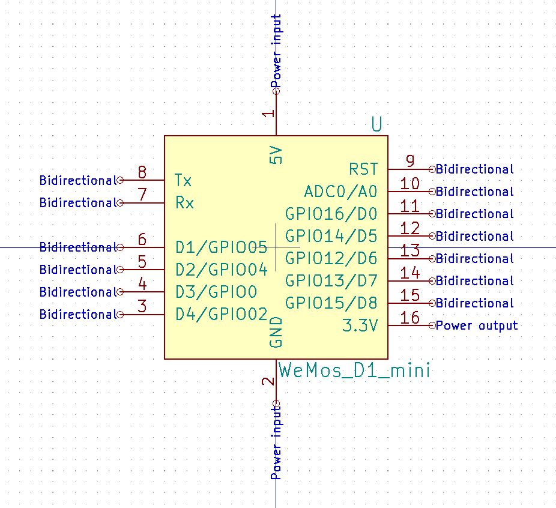
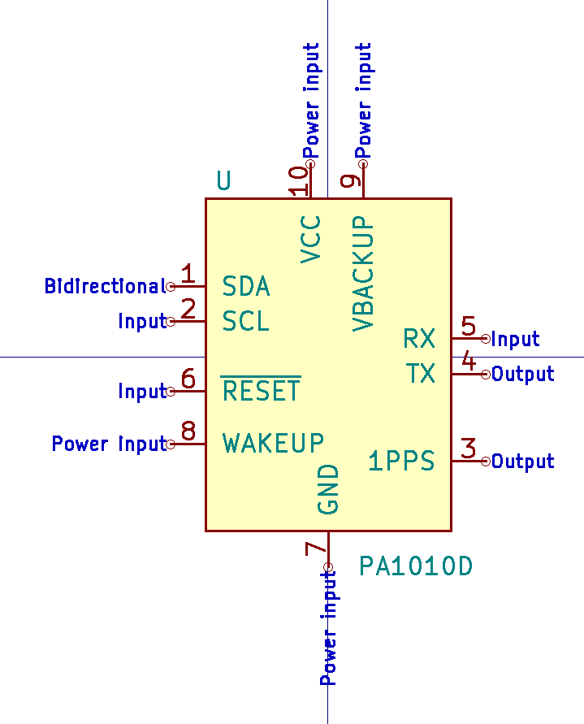

# Symbols

- [Adafruit_nRF52_feather](#adafruit_nrf52_feather)
- [Adafruit_sharp_display](#adafruit_sharp_display)
- [Sensor_UV](#sensor_uv)
- [Si7021_breakout_board](#si7021_breakout_board)
- [wemos_battery_shield](#wemos_battery_shield)
- [wemos_mini](#wemos_mini)
- [Adafruit LoRaWAN RFM9x](#adafruit_lorawan_rfm9x)
- [GPS PA1010D](#gps-pa1010d)

## Adafruit_nRF52_feather

## Adafruit_sharp_display

## Sensor_UV

## Si7021_breakout_board

## wemos_battery_shield

## wemos_mini

## Adafruit_LoRaWAN_RFM9x

## GPS_PA1010D

